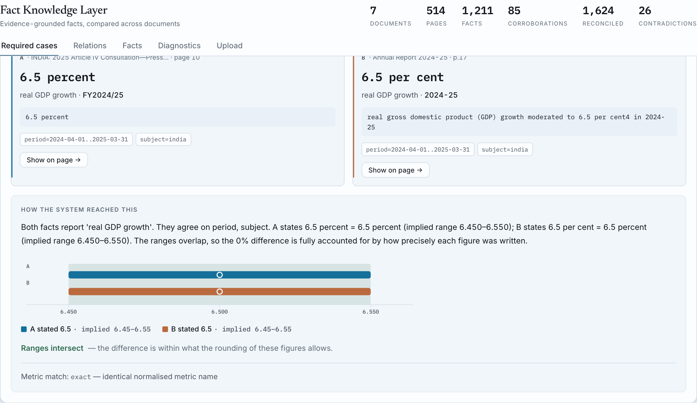
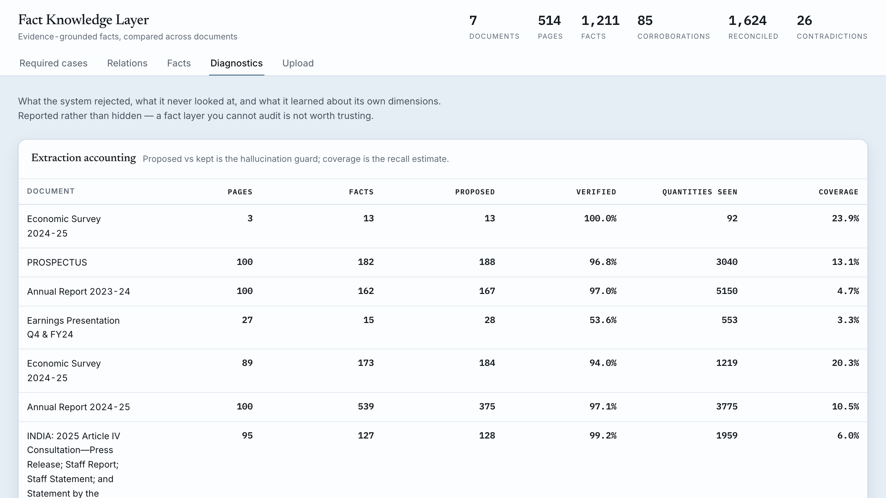
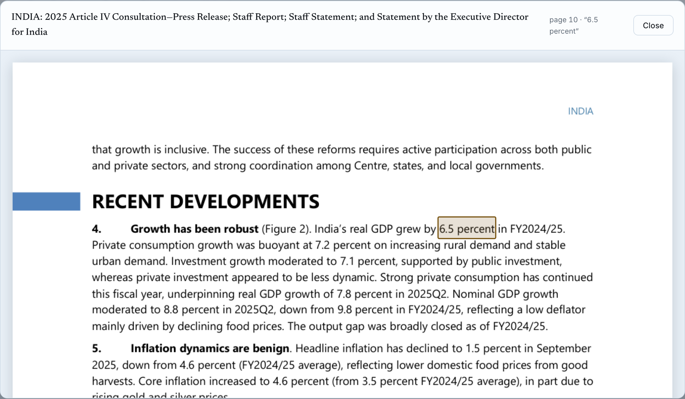
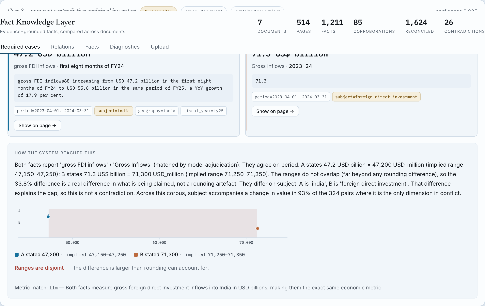
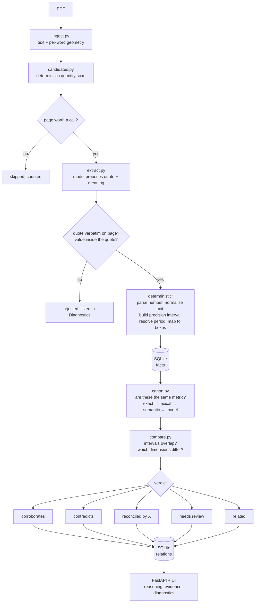

# Fact Knowledge Layer

Extracts evidence-backed facts from PDFs, links every fact to the exact ink it
came from, and works out whether facts across documents corroborate each other,
contradict each other, or only appear to disagree because they are measuring
subtly different things.

Built for the Superjoin engineering intern assignment.



*The IMF and the RBI report the same figure under different names and different
fiscal-year notation. The system links them, and shows exactly why.*

---

## The idea in one table

Every relationship verdict in this system reduces to a single question: **when
is a difference between two numbers a real difference?** The usual answer is a
percentage tolerance. That answer cannot work, and this corpus proves it:

| Pair (from the starter documents) | Relative gap | Correct verdict |
|---|---|---|
| `1.4 Mn tonnes` vs `1,429K tonnes` | **2.03 %** | agree — same figure |
| `6.4 %` vs `6.5 %` GDP growth | **1.54 %** | disagree — real difference |

Any fixed tolerance loose enough to accept the first also wrongly accepts the
second. There is no epsilon that separates them.

So the system doesn't use one. A figure as written is a *rounded* claim, and
how it was rounded is visible in its digits: `1.4` claims precision to ±0.05 Mn,
while `6.4` claims ±0.05 percentage points. Convert both sides to a common unit,
carry those intervals through, and ask whether they **intersect**:

```
1.4 Mn t   -> [1,350,000 , 1,450,000]  ─┐ overlap  -> agree
1,429K t   -> [1,428,500 , 1,429,500]  ─┘

6.4 %      -> [6.35 , 6.45]            ─┐ disjoint -> real difference
6.5 %      -> [6.45 , 6.55]            ─┘
```

Both verdicts fall out of the same rule, and the rule is arithmetic a reviewer
can check by hand. That is the whole design in miniature: **compute the
judgement, don't generate it.**

---

## Setup and run instructions

Requires Python 3.11+. No services, no Docker, no build step.

```bash
git clone <this repo> && cd factlayer

# 1. environment
python -m venv .venv && source .venv/bin/activate
pip install -r requirements.txt

# 2. credentials  (optional -- see "Running without a key" below)
cp .env.example .env
# put a Gemini key in it: https://aistudio.google.com/apikey
# GEMINI_API_KEY=...

# 3. build the knowledge layer from the starter documents
python scripts/ingest.py starter-datasets/starter-datasets/delhivery
python scripts/ingest.py starter-datasets/starter-datasets/india-macroeconomy

# 4. explore it
uvicorn factlayer.api:app --reload
# open http://127.0.0.1:8000
```

Upload further PDFs through the **Upload** tab in the UI, or:

```bash
curl -F "file=@your.pdf" "http://127.0.0.1:8000/api/documents?corpus=mine"
```

### Running without a key

Every model call is cached to `data/cache/`, keyed by a hash of the prompt, and
**those cache files are committed**. A clean checkout with no API key
reproduces the entire knowledge layer offline:

```bash
FACTLAYER_LLM=replay python scripts/ingest.py starter-datasets/starter-datasets/delhivery
```

In `replay` mode a cache miss is an error rather than a network call, so this is
also how the test suite stays hermetic. New PDFs still need a key.

### Tests and evaluations

```bash
pytest                                  # unit + reasoning tests, no key needed
python evals/run_evals.py               # offline evaluation suites
python evals/run_evals.py --with-db     # plus invariants over the built layer
```

---

## Video demo

Demo: //<https://www.loom.com/share/3d60f2951a5b4d6b97896d0fe7498d24>

A PDF being ingested, then all four required cases — a corroboration across two
documents, a genuine contradiction, an apparent contradiction explained by a
differing dimension, and a failure the system found in itself.

---

## What it produces on the starter corpus

Run with `make build` (45 pages per document; drop the cap to process all 511).

| Document | pages | sent | facts | verified | quantity coverage |
|---|---|---|---|---|---|
| Delhivery Prospectus 2022 | 100 | 45 | 182 | 96.8% | 13.1% |
| Delhivery Annual Report FY24 | 100 | 32 | 162 | 97.0% | 4.7% |
| Delhivery Q4 FY24 deck | 27 | 16 | 15 | **53.6%** | 3.2% |
| Economic Survey 2024-25 | 89 | 37 | 173 | 94.0% | 20.3% |
| RBI Annual Report 2024-25 | 100 | 64 | 539 | 97.1% | 10.5% |
| IMF Article IV 2025 | 95 | 45 | 127 | 99.2% | 6.0% |
| **Total** | **511** | | **1,198** | | |

**1,198 facts → 1,937 relations, 364 of them cross-document.** Verdicts: 1,607
reconciled, 122 held for review, 105 related, 83 corroborations, 20
contradictions.

Two of those numbers deserve explanation rather than burial.

**The system refuses to answer 122 times, and that is the point.** When two
values differ and nothing recorded distinguishes the facts — but a dimension
that usually *does* move values is simply absent from one of them — calling it a
contradiction asserts something the documents do not support. Those are
`needs_review`, with the reason attached. Adding that verdict cut contradictions
from 51 to 7 on the smaller corpus; every survivor was a genuine finding rather
than a guess. Which dimensions disqualify a comparison is not declared: a
dimension only counts if the corpus shows it moves values, so a missing `period`
(0.97) is fatal and a missing `scale` (0.33) is not.

**Corroboration is also strict.** It requires the same metric, the same period,
agreement on every recorded dimension, *and* overlapping precision intervals. An
earlier version was more generous — until it turned out those extra pairs had
values that coincided while a dimension differed. Q1 growth of 6.5% and
full-year growth of 6.5% are two different claims that happen to share a number.
Those are `related` now, not `corroborates`.

**Coverage is low (3–20%) and that is the weakest part of the system.** The
scanner detects far more salient quantities than become facts. Some of that gap
is deliberate — the extractor is told to prefer figures a reader would cite —
but not all of it, and the honest position is that recall on dense financial
tables is poor. The deck's 53.6% verification rate against 89–99% elsewhere is
the same story from the other side, and both are explained in Case 4.

### The schema really does grow

The extractor proposed **145 distinct qualifier keys** across the corpus, none of
them declared in advance: `geography`, `classification` (current/non-current),
`statement_type`, `scenario` (baseline/adjusted), `level_of_government`,
`comparison_period`, and so on.

And the engine learns which of them explain anything:

| dimension | explanatory power | observed |
|---|---|---|
| `period` | 0.965 | 780 of 806 pairs |
| `subject` | 0.887 | measured across the corpus |
| `status` | **0.300** | 1 of 6 |
| `scale` | **0.333** | 0 of 2 |

`period` almost always accompanies a change in value; `scale` never does — which
is correct, because units are normalised before comparison, so scale *should not*
move a value. Nothing told the system that. It measured it.



---

## The four required cases

All four are live in the UI under **Required cases**, selected by querying the
knowledge layer rather than hard-coded — `/api/cases`.

### 1. Corroborated across documents, expressed differently

The Q4 earnings deck reports `₹8,142 Cr`; the annual report reports `₹81,415 Mn`.
Different documents, different scales, different formatting.

```
A  8,142 ₹Cr  = 81,420 INR_million   implied range 81,415    – 81,425
B  81,415 ₹Mn = 81,415 INR_million   implied range 81,414.5  – 81,415.5
ranges overlap → the 0.006% difference is fully accounted for by rounding
```

The same mechanism links `₹127 Cr` to `₹1,266 Mn` (EBITDA) and, in the macro
corpus, the RBI's "6.5 per cent in 2024-25" to the IMF's "6.5 percent in
FY2024/25" — which requires the period normaliser to recognise those two
notations as one window.

Every fact carries its exact character span, so any figure can be shown boxed on
the page it came from:



### 2. A genuine contradiction

The RBI projects **6.5 %** real GDP growth for FY26; the IMF projects **6.6 %**
for the same year. Both are forward projections, both about India, same period.

```
A  6.5 %  implied range 6.450 – 6.550
B  6.6 %  implied range 6.550 – 6.650
ranges disjoint, and every recorded dimension matches
→ nothing in either document explains the gap → CONTRADICTS
```

Note the intervals *touch* at 6.55 and are still called disjoint. That is
deliberate: treating contact as agreement would merge every adjacent pair of
one-decimal figures in the corpus.

### 3. An apparent contradiction explained by context

The Economic Survey says **6.4 %** for FY25; the RBI says **6.5 %** for 2024-25 —
the same window, a 1.54 % gap, intervals disjoint. So the difference is real.
But the two facts differ on one dimension:

```
A  basis = first_advance_estimate   (Survey, published Jan 2025)
B  basis = provisional_estimate     (RBI,    published May 2025)
→ RECONCILED, explained by `basis`
```

That is a revision, not a disagreement. The system names the dimension that
explains it rather than asserting the facts are compatible.



Two other kinds of reconciliation appear in the same corpus, which matters
because it shows the mechanism is general rather than tuned to vintages:
**reporting scope** (standalone `74,540.82` vs consolidated `81,415.38`, same
metric, same year) and **period** (`₹8,142 Cr` for FY24 vs `₹2,076 Cr` for
Q4 FY24).

### 4. Failures I found, and how they are handled

Two failure modes, pulling in opposite directions. `scripts/diagnose.py` finds
both by querying the layer for its own inconsistencies.

**(a) Strict grounding rejects facts that were right.**

On slide 8 of the earnings deck, four charts sit side by side. Flattened to
text, the page reads:

```
… 582 663 740  FY22 FY23 FY24  4,191 4,552 5,077  FY22 FY23 FY24
Express Parcel revenue   PTL freight revenue(2)   1,579 1,101 1,429 …
```

The values arrive *before* their own chart title and interleaved with the
neighbouring chart's. The model read this correctly in substance — it proposed
`Express Parcel revenue = 4,191` — but quoted the label together with its
values, and that exact string does not occur on the page. **The verifier
rejected a fact that was semantically right.** The deck's verification pass rate
is 53.6% against 89–99% for the prose-heavy documents, and that gap is almost
entirely this.

That is the honest cost of strict grounding: recall traded for the guarantee
that no citation ever points at the wrong ink. I kept the strictness, because a
fact layer whose evidence is sometimes wrong is worse than one that admits what
it missed.

**(b) A wrong binding can still be verbatim — so it passes.**

The mirror image, and the more dangerous one. In the prospectus:

```
metric:  "Proforma Consolidated Total current liabilities"
  A = 12,168.01   quote: 'Total current liabilities … 12,168.01'
  B = 10,123.08   quote: 'Total non- current liabilities … 10,123.08'
```

The extractor read the **non-current** row and labelled it *current*. Both quotes
are genuinely on the page, so verification cannot catch it. The same shape
recurs wherever one sentence or row holds two figures separated by a qualifier
the extractor did not record:

```
'The Offer and the Net Offer constitute 14.84% and 14.78%, respectively…'
    → both figures extracted under one metric name
'foreign exchange reserves increased from USD 616.7 billion … to 704.9'
    → a from/to pair collapsed into one metric and period
```

**How the system handles it.** These surface downstream as contradictions
between two facts from the *same* document — which in a statutory filing almost
always means a misread table rather than an inconsistent document. They are
reported with both page spans attached, so a reviewer opens each side and settles
it in seconds, and `scripts/diagnose.py` ranks them. The system cannot tell
whether the document or its own reading is at fault; what it can do is refuse to
present the pair as settled fact.

**The fix, which is not built.** Reconstruct the table and chart grid from the
word geometry ingestion already captures, and hand the model a cell together
with its full header path instead of a flattened line. The coordinates are
already stored on every word — nothing new needs extracting. That single change
addresses both failure modes, which is why it is first on the next-steps list.

---

## Approach

### Architecture



The same pipeline, with the file each stage lives in:

```
PDF
 │
 ├─ ingest.py     text + per-word geometry; a char-offset → bounding-box map
 │                so any cited span can be drawn on the page
 │
 ├─ candidates.py deterministic scan for quantity-shaped tokens
 │                → page pre-filter, verification target, coverage metric
 │
 ├─ extract.py    model proposes {quote, metric, scope, period, qualifiers}
 │                → VERIFIER: quote must exist verbatim; value must be inside it
 │                → numbers, units, dates, coordinates all computed, never generated
 │
 ├─ canon.py      which metric names denote the same measurement
 │                (exact → lexical → semantic → model adjudication, cached)
 │
 ├─ compare.py    interval overlap + dimension diff → verdict + explanation
 │
 └─ store.py      SQLite; new documents link incrementally against existing facts
```

### The model is never allowed to produce a number

This is the central constraint. The extractor's output is checked before it
becomes a fact:

1. Its `quote` must appear **verbatim** on the page it names. Whitespace drift
   is tolerated (PDF text is full of spurious line breaks); anything looser is
   refused, because a quote we cannot pin to exact offsets is not evidence.
2. The `value_raw` it reports must appear **inside that quote**.
3. Only then are the number, its unit conversion, its precision interval, its
   period and its on-page rectangles computed — deterministically, from the page.

A hallucinated figure has no quote to match and cannot survive step 1. What the
model actually contributes is *interpretation*: what a figure measures, and how
it is scoped. That is the part that genuinely needs judgement.

The pass rate is reported per document in the **Diagnostics** tab, and rejected
proposals are listed rather than dropped silently.

### Facts carry an open set of dimensions

Two figures are only comparable if they measure the same thing under the same
conditions. Which conditions matter is document-specific — entity scope in a
filing, estimate vintage in a macro report, segment or geography in a table — so
the schema does not enumerate them. The extractor proposes qualifier keys
freely, and the comparison engine treats any key it has never seen as a
first-class dimension.

A fact is therefore: a metric, a subject, a quantity with a precision interval,
a normalised period, an **open dictionary of qualifiers**, and a span of
evidence.

### Which dimensions can explain a difference is learned, not declared

Hard-coding "period and scope are explanatory" would be exactly the kind of
document-specific rule the brief rules out. Instead the engine measures, across
every comparable pair in the corpus, how often each dimension accompanies a
change in value when it is the *only* thing in conflict:

```
P(values differ | this dimension is the sole conflict)
```

A dimension that almost always moves the value earns a high weight; a
reconciliation resting on a weak one is reported at low confidence. New
qualifier keys are scored the same way the moment they appear — which is what
lets the schema grow with the corpus rather than being fixed in advance. The
learned weights are visible in the **Diagnostics** tab.

### Verdict rules

With value agreement and a dimension diff in hand, the verdict is mechanical:

| values | conflicting dimensions | verdict |
|---|---|---|
| intervals overlap | — | **corroborates** |
| intervals disjoint | none | **contradicts** — nothing explains the gap |
| intervals disjoint | exactly one | **reconciled** by that dimension |
| intervals disjoint | several | **reconciled** by the strongest, lower confidence |

Confidence composes the three things that can undermine a verdict: either fact
being poorly extracted, the metric match being a model guess rather than a
string identity, and a reconciliation resting on a dimension that rarely
explains anything.

### Deciding when two metric names mean the same thing

This is where a fact layer quietly goes wrong. Merge too eagerly and you invent
contradictions: `revenue from operations` and `revenue from services` differ by
exactly the traded-goods line, so conflating them manufactures a conflict out of
correct arithmetic. Merge too timidly and cross-document corroboration is never
found, because one report writes `real GDP growth` and another writes
`real gross domestic product (GDP) growth`.

Four tiers, increasing in cost and decreasing in certainty:

1. identical normalised names → same, free, certain
2. high lexical similarity → adjudicate
3. high **semantic** similarity → adjudicate
4. neither → never compared

Tier 3 exists because string distance is blind to abbreviation:
`PTL freight tonnage` and `Part-truckload tonnage` are the same measurement and
score 63 on token-set ratio — below any threshold that isn't also flooded with
noise. Adjudications are cached in `data/metric_aliases.json`, so the alias map
is built from whatever the corpus actually contains.

### Engineering decisions and trade-offs

**The interface is deliberately quiet.** A warm beige ground with cream panels
— the way a printed report sits on a desk — low-chroma accents,
a serif for headings and a monospace for every figure and quote — because the
only thing on screen that should be loud is the data. The one chart that does
argumentative work (the range plot showing whether two implied intervals
intersect) was built to spec rather than to taste: point estimates with their
implied ranges on a shared axis, marks under 24px, hairline axes, a legend, and
values in text ink rather than series colour. It commits to one look rather
than shipping a dark mode, so there is a single set of contrast guarantees to
hold rather than two.

The chart colours were *validated, not eyeballed*. The two series clear the
chroma floor, colour-vision-deficiency separation (ΔE 15.5 protan against a
target of 8) and the normal-vision floor (ΔE 24.0 against a floor of 15) on the
panel surface. Every status colour clears WCAG AA for text against all three
surfaces (ground, panel and inset).

**SQLite over a graph database.** The brief notes that a graph database is not
the solution, and it is right: the interesting content is the *reasoning
attached to each edge*, not the topology. A graph store would have added
operational weight and answered no question the schema here cannot.

**Pages are batched into model calls.** Roughly five pages per call, bounded by
a character budget. This cuts call count about fivefold, keeps a 500-page corpus
inside free-tier request quotas, and — usefully — gives the model the
neighbouring pages it needs when a table's column headers sit on the page before
its rows. Facts are attributed per page; if the model misattributes one, the
verifier relocates it within the batch and records that it had to.

**Blocking before comparison.** Comparing all *N*² fact pairs is both wasteful
and meaningless. Facts are grouped by canonical metric, with bridges between
groups that are lexically or semantically close, so work stays proportional to
how much the corpus actually overlaps.

**Incremental ingestion.** Adding a document compares its facts against stored
facts and each other, never the whole corpus against itself. The Nth document
costs O(new × existing), not O(total²). Corpus-level dimension statistics are
carried in the store and updated as pairs accumulate.

**Degrading gracefully under a quota ceiling.** The first full run silently lost
18 of 22 pages to HTTP 429s, which surfaced as "fewer facts" rather than as an
error — the most dangerous shape a bug can take, because the output still looks
plausible. Four things came out of that:

- a shared token-bucket limiter and retry with server-supplied backoff;
- retrying transient 5xx as well as 429 (a 503 "model experiencing high demand"
  killed an entire run on its first document — that is weather, not a bug);
- a **model fallback chain**: free tiers meter each model separately and
  generously to none of them, so when one model's daily allowance is spent the
  run continues on the next rather than stopping;
- a **page budget** (`--max-pages`). Pages are scored by density of salient
  quantities, and the highest-value ones are processed first. A run cut short
  has still covered the pages a reader would cite. On the annual report this
  correctly puts the consolidated financial-statement notes and the balance
  sheet at the top, which is exactly where the reconcilable figures live.

The cache key deliberately excludes the model name, so a committed cache keeps
replaying after the default model changes or a run falls back across several.

### AI tools used

- **Gemini 2.5 Flash** for the three model-facing jobs: document profiling,
  fact proposal, and adjudicating whether two metric names match. Provider is
  pluggable (`FACTLAYER_LLM=gemini|openai|anthropic|replay`); OpenAI and
  Anthropic paths are implemented.
- **`text-embedding-004`** for semantic candidate generation between metric
  names, cached to `data/embeddings.json`.
- **Claude Code (Opus)** as a pair-programmer throughout: designing the
  precision-interval approach, writing the modules and the evaluation set, and
  finding the rate-limit bug above.

---

## Limitations and next steps

**What does not work well yet**

- **Coverage is well below detection (3–20%).** The scanner finds far more
  salient quantities than become facts. Some of that gap is intentional, but not
  all of it, and recall on dense financial tables is the weakest part of the
  system. Per-page coverage is reported in **Diagnostics** precisely so this is
  visible rather than hidden.
- **The qualifier vocabulary fragments.** 145 keys emerged, and some are the same
  idea under different names — `statement_type`, `financial_statement_type` and
  `statement`; `level` and `level_of_government`. Facts that ought to share a
  dimension therefore sometimes do not. The metric names get canonicalised
  through the three-tier resolver; qualifier *keys* get no such treatment, and
  they should.
- **The same distinction can live in a metric name or in a qualifier, and the
  adjudicator only sees the name.** The RBI writes "projected real GDP growth";
  the IMF writes "Real GDP (at market prices) growth" and puts
  `status: projection` in its qualifiers. Asked whether those two *names* mean
  the same thing, the model correctly says no — one is explicitly a forecast and
  the other is not — so a genuine RBI-vs-IMF comparison of FY26 projections
  never forms. Passing the qualifier set to the adjudicator alongside the name
  would fix it, at the cost of re-running every cached verdict.
- **Some qualifiers echo dimensions already modelled.** `fiscal_year` duplicates
  the parsed period. Unit echoes (`currency`, `scale`) are dropped, but the
  period case is not yet, so a stray `fiscal_year` string can add a spurious
  conflict.
- **Page density is an imperfect proxy for importance.** With a 45-page budget,
  the RBI report's key sentence — "real GDP growth for 2025-26 is projected at
  6.5 per cent" — ranked 55th of 98 pages and was skipped, because one prose
  sentence carries far fewer quantities than a statistical annexe. The budget
  saved quota at the cost of the single figure a reader would most want. A
  better ranking would weight the *rarity* of a page's metrics against the
  corpus, not just their count.
- **Only one ingest may write at a time.** SQLite takes a single writer, and
  running two rebuilds concurrently blocks rather than failing loudly. It should
  take an advisory lock and refuse, instead of queueing invisibly.
- **Wide tables remain the hardest case.** See "A failure I found", below.
- **Confidence is principled but uncalibrated.** The score composes real signals
  and is not arbitrary, but no labelled sample has been used to check that 0.8
  means 80 %. `evals/run_evals.py --with-db` reports the distribution; turning
  that into a reliability curve needs a few hundred adjudicated pairs.
- **Semantic facts are shallow.** Status claims are extracted, but a director
  appearing in a 2022 prospectus and absent from a 2024 report is an *absence*,
  and the system reasons over what is present.
- **Scanned PDFs are out of scope.** All six starter documents carry text
  layers; there is no OCR fallback.
- **One declared convention.** Fiscal years are assumed April–March unless a
  document says otherwise. It is configurable and recorded on every period
  rather than buried.

**What I would build next, in order**

1. **A labelled pair set and a reliability curve.** The highest-value missing
   piece. It turns confidence from a plausible number into a measured one, and
   lets the contradiction detector's operating point be *chosen* rather than
   assumed — in due diligence a missed red flag costs far more than a false one
   an analyst dismisses in seconds, so the threshold should sit deliberately
   toward recall.
2. **Table-structure-aware extraction.** Reconstruct the row/column grid from
   word geometry (already captured) and hand the model a cell with its header
   path, rather than a flattened line. This addresses the single largest source
   of both missed and wrong facts.
3. **Derived tie-outs.** The word geometry is enough to check that stated
   components sum to stated totals, turning arithmetic consistency into another
   class of evidence.
4. **Absence as evidence**, so a director present in one document and missing
   from a later one becomes a reviewable observation.

---

## Additional notes

- **No credentials in the repository.** `.env` is gitignored; `.env.example`
  documents the variables. The committed cache means a reviewer can evaluate the
  whole system without an account.
- **Nothing is keyed to the starter documents.** No filename, company, metric
  vocabulary or fixed schema appears in the code. The unit tables encode general
  knowledge (SI prefixes, Indian numbering, currency codes), and the fiscal-year
  convention is a declared, configurable default.
- **The four required cases are selected by query**, not hard-coded — see
  `/api/cases`. Running on a different corpus surfaces that corpus's own
  examples.
- **`/api/relations/{id}` returns the full reasoning record**, not just a
  verdict: the intervals, the dimension comparison, and how the metric names
  were matched and by what means. A reviewer who disagrees with a conclusion can
  see exactly which step produced it.
